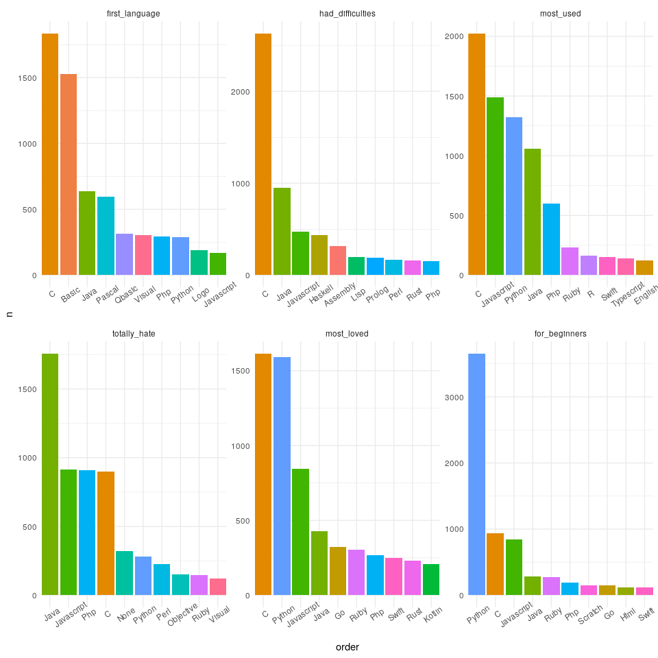

<!-- README.md is generated from README.Rmd. Please edit that file -->

# query\_twitter\_lang

``` r
library(rtweet)
library(tidyverse)
#> ── Attaching packages ─────────────────────────────────────────────────────────────────────────────────────────────────── tidyverse 1.2.1 ──
#> ✔ ggplot2 3.2.1     ✔ purrr   0.3.2
#> ✔ tibble  2.1.3     ✔ dplyr   0.8.3
#> ✔ tidyr   1.0.0     ✔ stringr 1.4.0
#> ✔ readr   1.3.1     ✔ forcats 0.4.0
#> ── Conflicts ────────────────────────────────────────────────────────────────────────────────────────────────────── tidyverse_conflicts() ──
#> ✖ dplyr::filter()  masks stats::filter()
#> ✖ purrr::flatten() masks rtweet::flatten()
#> ✖ dplyr::lag()     masks stats::lag()
```

``` r
query <- '1. First language:'

rt <- search_tweets(q = query,type = "mixed", n = 18000, include_rts = FALSE)

saveRDS(rt,'rt.rds')
```

``` r
rt <- read_rds('rt.rds')
```

``` r
rt2 <- rt %>% 
  select(user_id,status_id,created_at,name,favorite_count,status_url,location,followers_count,text)

rt2 <- rt2 %>% 
  mutate(es_meme = str_detect(text,'1. First language:'),
         text= str_remove_all(text,'(http)(s)?([^ ]*)')) %>%
  filter(es_meme) 

answers <- rt2 %>% 
  select(status_id,text) %>% 
  separate(text, into = c('first_language','had_difficulties','most_used','totally_hate', 'most_loved','for_beginners'),sep = '\n',extra = 'drop') %>% 
  mutate(first_language= trimws(str_extract(first_language,'(?<=1. First language:).*'),which = 'both'),
         had_difficulties= trimws(str_extract(had_difficulties,'(?<=2. Had difficulties:).*'),which = 'both'),
         most_used= trimws(str_extract(most_used,'(?<=3. Most used:).*'),which = 'both'),
         totally_hate= trimws(str_extract(totally_hate,'(?<=4. Totally hate:).*'),which = 'both'),
         most_loved = trimws(str_extract(most_loved,'(?<=5. Most loved:).*'),which = 'both'),
         for_beginners = trimws(str_extract(for_beginners,'(?<=6. For beginners:).*'),which = 'both'),
         ) %>% 
  mutate(first_language = str_extract(first_language,'[[:alnum:]]*'),
         had_difficulties = str_extract(had_difficulties,'[[:alnum:]]*'),
         most_used = str_extract(most_used,'[[:alnum:]]*'),
         totally_hate = str_extract(totally_hate,'[[:alnum:]]*'),
         most_loved = str_extract(most_loved,'[[:alnum:]]*'),
         for_beginners = str_extract(for_beginners,'[[:alnum:]]*')) %>% 
  drop_na() %>% 
  pivot_longer(-status_id,names_to = 'question',values_to = 'answer')
#> Warning: Expected 6 pieces. Missing pieces filled with `NA` in 1334 rows
#> [11, 16, 17, 30, 35, 36, 46, 55, 75, 104, 106, 123, 129, 141, 152, 153,
#> 156, 158, 167, 170, ...].
```

``` r
ggdata <- answers %>% 
  mutate(question = factor(question, levels =c('first_language','had_difficulties','most_used','totally_hate', 'most_loved','for_beginners')),
         answer = str_to_title(answer)) %>% 
  filter(answer!='') %>% 
  group_by(question,answer) %>% 
  summarise(n=n()) %>%
  top_n(10, wt = n) %>% 
  ungroup() %>%
  arrange(-n) %>%
  mutate(order = factor(row_number()))

  ggplot(ggdata,aes(order, n,fill=answer)) + 
  geom_col()+
  facet_wrap(~ question, scales = 'free')+
  theme_minimal()+
   scale_x_discrete(
    breaks = ggdata$order,
    labels = ggdata$answer,
    expand = c(0,0)
  ) +
  theme(legend.position = 'none',
        axis.text.x = element_text(angle = 35)) 
```

<!-- -->

``` r
ggsave('plot.png')
#> Saving 7 x 5 in image
```
